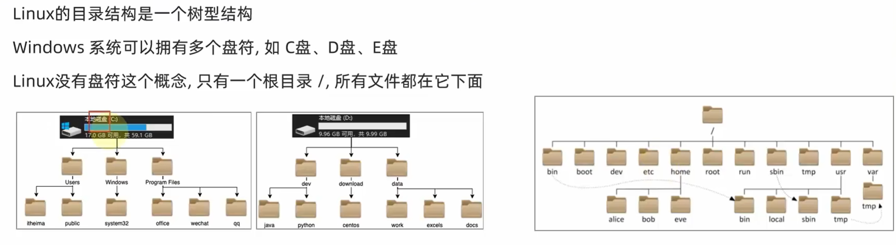

## 一. Linux文件与目录结构

### 1. 一切皆文件

Linux只有一个根目录`/`，



Linux下一切皆文件，即使是windows系统下的文件夹，我们也看作是文件，只不过它叫目录文件，抽象的看，在逻辑上它是树的一个节点，记录了该节点下的文件的位置，信息等。“一切皆是文件”是 Unix/Linux 的基本哲学之一


首先，在windows中是文件的东西,它们在linux中也是文件，其次一些在windows中不是文件的东西, 比如进程, 磁盘, 也被抽象成了文件.。你可以使用访问文件的方法访问它们获得信息。甚至一些很离谱的东西，比如管道，也是文件。甚至类似于socket（套接字）这样的东西, 使用的接口跟文件接口也是一致的。

这样做最明显的好处是，开发者仅需要使用一套 API 和开发工具即可调取 Linux 系统中绝大部分的资源。举个简单的例子，Linux 中几乎所有读（读文件，读系统状态，读 socket，读PIPE）的操作都可以用read函数来进行；几乎所有更改（更改文件，更改系统参数，写 socket，写 PIPE）的操作都可以用write函数来进行。

不利之处在于，使用任何硬件设备都必须与根目录下某一目录执行挂载操作，否则无法使用。我们知道，本身Linux具有一个以根目录为树根的文件目录结构，每个设备也同样如此，它们是相互独立的。如果我们想通过Linux上的根目录找到设备文件的目录结构，就必须将这两个文件系统目录合二为一，这就是挂载的真正含义。


___

### 2. Linux目录结构

由于linux是开放源代码，各大公司和团体根据linux的核心代码做各自的操作，编程。这样就造成在根下的目录的不同。这样就造成个人不能使用他人的linux系统的PC。因为你根本不知道一些基本的配置，文件在哪里。。。这就造成了混乱。这就是FHS（Filesystem Hierarchy Standard ）机构诞生的原因。该机构是linux爱好者自发的组成的一个团体，主要是是对linux做一些基本的要求，不至于是操作者换一台主机就成了linux的‘文盲’。

根据FHS(http://www.pathname.com/fhs/)的官方文件指出， 他们的主要目的是希望让使用者可以了解到已安装软件通常放置于那个目录下， 所以他们希望独立的软件开发商、操作系统制作者、以及想要维护系统的用户，都能够遵循FHS的标准。 也就是说，FHS的重点在于规范每个特定的目录下应该要放置什么样子的数据而已。 这样做好处非常多，因为Linux操作系统就能够在既有的面貌下(目录架构不变)发展出开发者想要的独特风格。

#### 2.1. 根目录 (/) 的意义与内容

根目录是整个系统最重要的一个目录，因为不但所有的目录都是由根目录衍生出来的， 同时根目录也与开机/还原/系统修复等动作有关。 由于系统开机时需要特定的开机软件、核心文件、开机所需程序、 函式库等等文件数据，若系统出现错误时，根目录也必须要包含有能够修复文件系统的程序才行。 因为根目录是这么的重要，所以在FHS的要求方面，他希望根目录不要放在非常大的分区， 因为越大的分区内你会放入越多的数据，如此一来根目录所在分区就可能会有较多发生错误的机会。

因此FHS标准建议：根目录(/)所在分区应该越小越好， 且应用程序所安装的软件最好不要与根目录放在同一个分区内，保持根目录越小越好。 如此不但效能较佳，根目录所在的文件系统也较不容易发生问题。说白了，就是根目录和Windows的C盘一个样。

根据以上原因，FHS认为根目录(/)下应该包含如下子目录：

| 目录   | 应放置档案内容                                               |
| ------ | ------------------------------------------------------------ |
| /bin   | 系统有很多放置执行档的目录，但/bin比较特殊。因为/bin放置的是在单人维护模式下还能够被操作的指令。在/bin底下的指令可以被root与一般帐号所使用，主要有：cat,chmod(修改权限), chown, date, mv, mkdir, cp, bash等等常用的指令。 |
| /boot  | 主要放置开机会使用到的档案，包括Linux核心档案以及开机选单与开机所需设定档等等。Linux kernel常用的档名为：vmlinuz ，如果使用的是grub这个开机管理程式，则还会存在/boot/grub/这个目录。 |
| /dev   | 在Linux系统上，任何装置与周边设备都是以档案的型态存在于这个目录当中。 只要通过存取这个目录下的某个档案，就等于存取某个装置。比要重要的档案有/dev/null, /dev/zero, /dev/tty , /dev/lp*, / dev/hd*, /dev/sd*等等 |
| /etc   | 系统主要的设定档几乎都放置在这个目录内，例如人员的帐号密码档、各种服务的启始档等等。 一般来说，这个目录下的各档案属性是可以让一般使用者查阅的，但是只有root有权力修改。 FHS建议不要放置可执行档(binary)在这个目录中。 比较重要的档案有：/etc/inittab, /etc/init.d/, /etc/modprobe.conf, /etc/X11/, /etc/fstab, /etc/sysconfig/等等。 另外，其下重要的目录有：/etc/init.d/ ：所有服务的预设启动script都是放在这里的，例如要启动或者关闭iptables的话： /etc/init.d/iptables start、/etc/init.d/ iptables stop/etc/xinetd.d/ ：这就是所谓的super daemon管理的各项服务的设定档目录。/etc/X11/ ：与X Window有关的各种设定档都在这里，尤其是xorg.conf或XF86Config这两个X Server的设定档。 |
| /home  | 这是系统预设的使用者家目录(home directory)。 在你新增一个一般使用者帐号时，预设的使用者家目录都会规范到这里来。比较重要的是，家目录有两种代号：  ~ ：代表当前使用者的家目录，而 ~guest：则代表用户名为guest的家目录。 |
| /lib   | 系统的函式库非常的多，而/lib放置的则是在开机时会用到的函式库，以及在/bin或/sbin底下的指令会呼叫的函式库而已 。 什么是函式库呢？妳可以将他想成是外挂，某些指令必须要有这些外挂才能够顺利完成程式的执行之意。 尤其重要的是/lib/modules/这个目录，因为该目录会放置核心相关的模组(驱动程式)。 |
| /media | media是媒体的英文，顾名思义，这个/media底下放置的就是可移除的装置。 包括软碟、光碟、DVD等等装置都暂时挂载于此。 常见的档名有：/media/floppy, /media/cdrom等等。 |
| /mnt   | 如果妳想要暂时挂载某些额外的装置，一般建议妳可以放置到这个目录中。在古早时候，这个目录的用途与/media相同啦。 只是有了/media之后，这个目录就用来暂时挂载用了。 |
| /opt   | 这个是给第三方协力软体放置的目录 。 什么是第三方协力软体啊？举例来说，KDE这个桌面管理系统是一个独立的计画，不过他可以安装到Linux系统中，因此KDE的软体就建议放置到此目录下了。 另外，如果妳想要自行安装额外的软体(非原本的distribution提供的)，那么也能够将你的软体安装到这里来。 不过，以前的Linux系统中，我们还是习惯放置在/usr/local目录下。 |
| /root  | 系统管理员(root)的家目录。 之所以放在这里，是因为如果进入单人维护模式而仅挂载根目录时，该目录就能够拥有root的家目录，所以我们会希望root的家目录与根目录放置在同一个分区中。 |
| /sbin  | Linux有非常多指令是用来设定系统环境的，这些指令只有root才能够利用来设定系统，其他使用者最多只能用来查询而已。放在/sbin底下的为开机过程中所需要的，里面包括了开机、修复、还原系统所需要的指令。至于某些伺服器软体程式，一般则放置到/usr/sbin/当中。至于本机自行安装的软体所产生的系统执行档(system binary)，则放置到/usr/local/sbin/当中了。常见的指令包括：fdisk, fsck, ifconfig, init, mkfs等等。 |
| /srv   | srv可以视为service的缩写，是一些网路服务启动之后，这些服务所需要取用的资料目录。 常见的服务例如WWW, FTP等等。 举例来说，WWW伺服器需要的网页资料就可以放置在/srv/www/里面。呵呵，看来平时我们编写的代码应该放到这里了。 |
| /tmp   | 这是让一般使用者或者是正在执行的程序暂时放置档案的地方。这个目录是任何人都能够存取的，所以你需要定期的清理一下。当然，重要资料不可放置在此目录啊。 因为FHS甚至建议在开机时，应该要将/tmp下的资料都删除。 |

事实上FHS针对根目录所定义的标准就仅限于上表，不过仍旧有些目录也需要我们了解一下，具体如下：

| 目录        | 应放置文件内容                                               |
| ----------- | ------------------------------------------------------------ |
| /lost+found | 这个目录是使用标准的ext2/ext3档案系统格式才会产生的一个目录，目的在于当档案系统发生错误时，将一些遗失的片段放置到这个目录下。 这个目录通常会在分割槽的最顶层存在，例如你加装一个硬盘于/disk中，那在这个系统下就会自动产生一个这样的目录/disk/lost+found |
| /proc       | 这个目录本身是一个虚拟文件系统(virtual filesystem)喔。 他放置的资料都是在内存当中，例如系统核心、行程资讯(process)（是进程吗?）、周边装置的状态及网络状态等等。因为这个目录下的资料都是在记忆体（内存）当中，所以本身不占任何硬盘空间。比较重要的档案（目录）例如： /proc/cpuinfo, /proc/dma, /proc/interrupts, /proc/ioports, /proc/net/*等等。呵呵，是虚拟内存吗[guest]？ |
| /sys        | 这个目录其实跟/proc非常类似，也是一个虚拟的档案系统，主要也是记录与核心相关的资讯。 包括目前已载入的核心模组与核心侦测到的硬体装置资讯等等。 这个目录同样不占硬盘容量。 |


除了这些目录的内容之外，另外要注意的是，因为根目录与开机有关，开机过程中仅有根目录会被挂载， 其他分区则是在开机完成之后才会持续的进行挂载的行为。就是因为如此，因此根目录下与开机过程有关的目录， 就不能够与根目录放到不同的分区去。那哪些目录不可与根目录分开呢？有底下这些：

/etc：配置文件

/bin：重要执行档

/dev：所需要的装置文件

/lib：执行档所需的函式库与核心所需的模块

/sbin：重要的系统执行文件

这五个目录千万不可与根目录分开在不同的分区。


#### 2.2. /usr 的意义与内容

依据FHS的基本定义，/usr里面放置的数据属于可分享的与不可变动的(shareable, static)， 如果你知道如何透过网络进行分区的挂载(例如在服务器篇会谈到的NFS服务器)，那么/usr确实可以分享给局域网络内的其他主机来使用喔。

/usr不是user的缩写，其实usr是Unix Software Resource的缩写， 也就是Unix操作系统软件资源所放置的目录，而不是用户的数据啦。这点要注意。 FHS建议所有软件开发者，应该将他们的数据合理的分别放置到这个目录下的次目录，而不要自行建立该软件自己独立的目录。

因为是所有系统默认的软件(distribution发布者提供的软件)都会放置到/usr底下，因此这个目录有点类似Windows 系统的C:\Windows\ + C:\Program files\这两个目录的综合体，系统刚安装完毕时，这个目录会占用最多的硬盘容量。 一般来说，/usr的次目录建议有底下这些：

| 目录          | 应放置文件内容                                               |
| ------------- | ------------------------------------------------------------ |
| /usr/X11R6/   | 为X Window System重要数据所放置的目录，之所以取名为X11R6是因为最后的X版本为第11版，且该版的第6次释出之意。 |
| /usr/bin/     | 绝大部分的用户可使用指令都放在这里。请注意到他与/bin的不同之处。(是否与开机过程有关) |
| /usr/include/ | c/c++等程序语言的档头(header)与包含档(include)放置处，当我们以tarball方式 (*.tar.gz 的方式安装软件)安装某些数据时，会使用到里头的许多包含档。 |
| /usr/lib/     | (类似C:\Windows\System32)包含各应用软件的函式库、目标文件(object file)，以及不被一般使用者惯用的执行档或脚本(script)。 某些软件会提供一些特殊的指令来进行服务器的设定，这些指令也不会经常被系统管理员操作， 那就会被摆放到这个目录下啦。要注意的是，如果你使用的是X86_64的Linux系统， 那可能会有/usr/lib64/目录产生 |
| /usr/local/   | (用户级程序目录，类似C:\Program Files)系统管理员在本机自行安装自己下载的软件(非distribution默认提供者)，建议安装到此目录， 这样会比较便于管理。举例来说，你的distribution提供的软件较旧，你想安装较新的软件但又不想移除旧版， 此时你可以将新版软件安装于/usr/local/目录下，可与原先的旧版软件有分别啦。 你可以自行到/usr/local去看看，该目录下也是具有bin, etc, include, lib...的次目录 |
| /usr/sbin/    | 非系统正常运作所需要的系统指令。最常见的就是某些网络服务器软件的服务指令(daemon) |
| /usr/share/   | 放置共享文件的地方，在这个目录下放置的数据几乎是不分硬件架构均可读取的数据， 因为几乎都是文本文件嘛。在此目录下常见的还有这些次目录：/usr/share/man：联机帮助文件/usr/share/doc：软件杂项的文件说明/usr/share/zoneinfo：与时区有关的时区文件 |
| /usr/src/     | 一般原始码建议放置到这里，src有source的意思。至于核心原始码则建议放置到/usr/src/linux/目录下。 |


### 3.Linux文件类型与后缀名

文件在底层都是相同的，都是一长串二进制串，而不同的编码解码，或者说数据的排布格式，决定了文件的“表现形式”，如二进制可执行程序文件，文本文件，图片文件等。

一谈到文件类型，不同于Windows的文件类型，比如file.txt、file.doc、file.sys、file.mp3、file.exe等，根据文件的后缀就能判断文件的类型，即Windows是以文件的表现形式进行分类。但在Linux一个文件是否能被执行，表现为哪种形式，和后缀名没有太大的关系，主要看文件的属性有关。但我们了解一下Linux文件的后缀名还是有必要的，特别是我们自己创建一些文件，最好还是加后缀名，这样做的目的是仅仅是为了我们的在应用时方便。

现在的Linux桌面环境和Windows一样智能化，文件的类型是和相应的程序关联的。在我们打开某个文件时，系统会自动判断用哪个应用程序打开。如果从这方面来说，Linux桌面环境和Windows桌面没有太大的区别。

在Linux中，带有扩展名的文件，只能代表程序的关联，并不能说明文件是可以执行或如何表现，从这方面来说，Linux的扩展名没有太大的意义。

Linux文件类型和Linux文件的文件名所代表的意义是两个不同的概念。我们通过一般应用程序而创建的比如file.txt、file.tar.gz ，这些文件虽然要用不同的程序来打开，但放在Linux文件类型中衡量的话，大多是常规文件（也被称为普通文件）。

Linux文件类型常见的有：普通文件（文本文件，二进制可执行文件）、目录、字符设备文件、块设备文件、符号链接文件等，这样分类更像是在反映一种操作系统对硬件进行抽象时产生的不同结果。


## 二. Linux常用基础命令

### 1. 基础命令格式

命令行：命令提示符页面，只能处理字符串(文本)，以纯“字符串”的形式操作系统，用各种字符化的命令对系统发出操作指令，其本身也是一个程序。

命令：即执行Linux程序

>Linux命令解释程序的工作流程如下：
>
>1. 用户输入命令：用户在终端窗口中输入需要执行的命令，例如”ls”。
>2. Shell解释命令：用户输入的命令首先被Shell解释。Shell是一种命令行解释器，负责解析并执行用户输入的命令。它会将命令分解成命令名和参数，以及执行命令所需的其他信息。
>3. 执行命令：Shell根据用户输入的命令名，在系统中找到对应的可执行程序。如果找到了对应的程序，Shell会创建一个子进程，并使用exec系统调用来执行该程序。如果命令是一个内置命令，Shell则直接执行该命令。
>4. 程序执行：子进程获得了命令的控制权后，会将命令所需的参数和其他信息传递给相应的程序。程序开始执行，并根据命令的功能进行相关操作。执行过程中，程序可能会读取文件、修改系统状态、向终端输出信息等。
>5. 程序结束：当程序执行完毕或遇到错误时，会返回执行结果或错误信息。Shell会接收到程序的返回值，并将其显示给用户。
>6. Shell等待下一条命令：程序执行完毕后，Shell会等待用户输入下一条命令，循环执行上述步骤。
>
>总结来说，Linux命令解释程序的工作流程包括用户输入命令、Shell解释命令、执行命令、程序执行以及Shell等待下一条命令。通过这个流程，用户可以通过命令行界面与系统交互，并完成各种操作。

==通用格式：==

`command [-options] [parameter]`

- command：命令本身

- -options：[可选]命令的一些选项/标识符，可以通过选项控制命令的行为细节或指定特定的操作

  `-` 单横线选项后面跟的参数必须是单字符参数，一个字符表示一个参数，可以多个参数写在同一个横线后面

  `--` 双横线选项后面跟的参数必须是多字符参数（单词），双横线后只能跟一个参数。

- parame：[可选]命令的参数，多数用于命令的指向目标（若跟在选项后面，视为该选项的参数）等。

  在需要加参数且为多个参数的时候，参数可以使用“=”分隔，也可以使用空格分隔。

==使用终端的常用技巧及快捷键：==

**放大终端窗口字体**：`ctrl + shift + =`<br>**缩小终端窗口字体**：`ctrl + -`

**查阅命令帮助信息**：	两个选项

```shell
command --help
#显示command命令的帮助信息
man command
#查阅command命令的使用手册manual
```

使用`man`（手册形式展示文件内容）时的操作键：

| 空格键 | 显示手册页的下一页   |
| :----- | :------------------- |
| Enter  | 一次滚动手册页的一行 |
| b      | 回滚一屏             |
| f      | 前滚一屏             |
| q      | 退出                 |
| /word  | 搜索"word"字符串     |


输入clear或使用快捷键`ctrl + L` ，可以实现**清屏**

直接输入文件的名字作为命令，若该文件是可执行程序，相当于直接**执行该程序**

**强制终止程序运行**：`ctrl + C`

**退出账户当前登录的shell或退出某些特定程序的专属界面**：`ctrl + d`或使用命令`logout`

**自动补全**：在敲出命令的前几个字母后，按下`Tab` 键

- 如果输入的没有歧义，终端会自动补全
- 如果有歧义，再按一下`Tab` ，终端会打印出可能存在的命令

**追溯曾经使用过的命令**：

- 按`上 / 下`光标键可以在曾经使用过的命令之间进行切换
- 若要退出选择并且不想执行当前选中的命令，按`ctrl + C`
- `history`命令查看历史输入过的命令

**光标移动快捷键**：

- `ctrl + a`：跳到命令开头
- `ctrl + e`：跳到命令结尾
- `ctrl + 键盘左键`：向左跳一个单词
- `ctrl + 键盘右键`：向右跳一个单词

**文件路径表示相关**：

​        绝对路径：以根目录为起点，路径描述以`/`开头

​	相对路径：以当前目录为起点，路径描述无需以`/`开头

​	特殊路径符：

- .  表示当前目录
- ..  表示上一级目录
- ~  表示用户的home目录

**可以这样理解，对于操作系统或终端来说，linux每个文件的名字就是其路径，文件名=文件路径；只是对我们人来说，我们起名或说一个文件的名字时，常忽略前面的路径，只说文件自身的名字，也可以知道文件的位置、路径，但终端并不能仅通过名字就知道文件位置**

直接输入文件的绝对路径（相对路径不行）（这里的路径或者说可以叫名字）作为命令，若该文件是可执行程序，相当于直接**执行该程序**

---


### 2. 文件和目录相关命令

- 查看目录内容

```shell
# ls:list,列出目录的内容
ls [-a -l -h] [文件路径]
# -a:all，列出全部文件
# -l:列表（竖向排列）形式展示内容，并展示更多信息
# -h:使用 -lh，显示文件的大小单位
# 参数默认为当前所在工作目录
```

- 切换工作目录

```shell
# cd: Change Directory,更改当前所在的工作目录
cd [文件路径]
# 参数默认为回到用户的home目录
```

- 查看当前工作目录路径

```shell
# pwd: Print Work Directory
pwd
```

- 创建新的目录(文件夹)

```shell
# mkdir: Make Directory
mkdir [-p] 文件路径
# -p: 表示自动创建不存在的父目录，适用于创建连续多层级的目录
# 参数必填，表示要创建的文件夹的路径，相对或绝对表示方法均可
```

- 创建新的文件

```shell
# touch
touch 文件路径
# 参数必填，表示要创建的文件的路径
```

- 拷贝文件 / 文件夹（目录文件）

```shell
# cp: copy, 复制文件/文件夹
cp [-r] 参数1 参数2
# -r: 可选，用于复制文件夹，表示递归
# 参数1: 文件路径，表示被复制的文件或文件夹
# 参数2: 文件路径，表示要复制去的地方，若为文件夹，则复制到文件夹内或复制并重命名文件夹；若为文件，则复制并重命名文件
```

- 移动文件 / 文件夹（目录文件），为文件 / 文件夹（目录文件）改名

```shell
# mv: move, 移动文件/文件夹，为文件 / 文件夹改名
mv 参数1 参数2
# 参数1: 文件路径，表示被移动的文件或文件夹
# 参数2: 文件路径，表示要移动去的地方，若为文件夹，则移动到文件夹内或移动并重命名文件夹；若为文件，则移动并重命名文件
```


mv 参数设置与运行结果（cp也可参考此表）

| 命令格式                                         | 运行结果                                                                                                                                                      |
| :----------------------------------------------- | :------------------------------------------------------------------------------------------------------------------------------------------------------------ |
| `mv source_file(文件) dest_file(文件)`           | 将源文件名 source_file 改为目标文件名 dest_file                                                                                                               |
| `mv source_file(文件) dest_directory(目录)`      | 将文件 source_file 移动到目标目录 dest_directory 中                                                                                                           |
| `mv source_directory(目录) dest_directory(目录)` | 目录名 dest_directory 已存在，将 source_directory 移动到目录名 dest_directory 中；目录名 dest_directory 不存在则 source_directory 改名为目录名 dest_directory |
| `mv source_directory(目录) dest_file(文件)`      | 出错                                                                                                                                                          |


- 删除文件 / 文件夹（目录文件）

```shell
# rm: remove, 删除文件/文件夹
rm [-r -f] 参数
# -r: 可选，用于删除文件夹，表示递归
# -f: 可选，强制删除，不弹出提示（root超级管理员用户）
# 参数: 表示要删除的文件或文件夹的路径
```

删除当前目录下的所有文件及目录，命令行为：

```shell
rm  -rf  * 
```

文件一旦通过rm命令删除，则无法恢复，所以必须格外小心地使用该命令。


- 查找命令对应的程序文件位置

```shell
# Linux命令的本体就是一个个二进制可执行程序，我们可以通过which命令，查找所使用的一系列命令的程序文件存放在哪里
which 要查找的命令
```


- 在指定目录下查找匹配的文件和目录

```shell
# find: 在指定目录下查找特定匹配的文件和目录，它可以使用不同的选项来过滤和限制查找的结果
find [文件路径] [匹配条件] [动作]
# 路径 是要查找的目录路径，可以是一个目录或文件名，也可以是多个路径，多个路径之间用空格分隔，如果未指定路径，则默认为当前目录。
# 匹配条件 是可选参数，用于指定查找的条件，可以是文件名、文件类型、文件大小等等。
# 动作 可选的，用于对匹配到的文件执行操作，比如删除、复制等。
```


匹配条件 中可使用的选项有二三十个之多，以下列出最常用的部份：

- `-name pattern`：按文件名查找，文件名`pattern`支持使用通配符 `*` 和 `?`。

- `-type type`：按文件类型查找，可以是 `f`（普通文件）、`d`（目录）、`l`（符号链接）等。

- `-size [+-]size[cwbkMG]`：按文件大小查找，支持使用 `+` 或 `-` 表示大于或小于指定大小，单位可以是 `c`（字节）、`w`（字数）、`b`（块数）、`k`（KB）、`M`（MB）或 `G`（GB）。

- `-mtime days`：按修改时间查找，支持使用 `+` 或 `-` 表示在指定天数前或后，days 是一个整数表示天数。

- `-user username`：按文件所有者查找。

- `-group groupname`：按文件所属组查找。

  

### 3. 文件内容读写相关命令

**Linux系统下任何文件的读写是按文本文件进行处理**

- 查看文件内容

```shell
# cat: 直接将内容全部显示在终端
cat [-b -n] 文件路径
-b: 对非空输出行编号
-n: 对所有输出行编号

# more: 支持翻页，若文件内容过多可以一页页的展示(手册形式)
more 文件路径
```

- 在文件中进行文本搜索，模式查找

```shell
# grep: 通过正则表达式过滤文件行，实现模式查找/文本搜索
grep [-n -i] "正则表达式" 文件路径
# -n: 显示匹配行的行号
# -i: 忽略大小写
# 正则表达式 : ^a(搜索以a开头的行), ke$(搜索以ke结束的行)
# 文件路径: 必填，可使用管道符作为输入
```

- 统计文件的行数、单词数量、字节数

```shell
# wc: 统计文件的行数、单词数量、字节数
wc [-c -m -l -w] 文件路径
# -c: 统计bytes的数量
# -m: 统计字符的数量
# -l: 统计行数
# -w: 统计单词数量
# 文件路径: 必填，可使用管道符作为输入
```


### 4. 输入输出流相关命令

- **管道符 `|`** : 将一个命令的输出通过管道作为另一个命令的输入
- **echo命令**：在命令行输出指定字符串内容

```shell
echo 输出的内容
# 无需选项，只有一个参数，表示要输出的字符串，复杂内容可用" "包围
echo `pwd`
# 将命令用反引号包围，被反引号包围的内容不再作为普通字符串直接输出，而是会先被作为命令执行，再将结果输出到命令行
```

- **重定向符**: 执行命令的结果（如echo命令），若不想默认输出到终端命令行，可使用重定向符号写入文件
  - `>` : 将左侧命令的结果，覆盖写入到符号右侧文件
  - `>>` : 将左侧命令的结果，追加写入到符号右侧文件

- **tail命令**: 查看文件尾部内容，跟踪文件的最新更改

```shell
tail [-f -num] 文件路径
# -f: 表示持续跟踪，即监听功能
# -num: 具体数字，表示查看尾部 num 行，不填则默认10行
# 文件路径: 必填
```

- 其他一些符号的作用

```shell
command &
# 在后台执行command
command1 && command2
# && 表示逻辑“与”，前一条命令执行成功时才执行后一条命令；若前一条命令执行失败，后一条命令不执行（短路求值）
command1 || command2
# || 表示逻辑“或”，前一条命令执行成功时，后一条命令不会再执行；若前一条命令执行失败，后一条命令才执行（短路求值）
command1;command2
# ; 表示每个命令从左往右依次执行，每个命令彼此之间没有关联
```


## 三. 用户管理与权限

操作系统采用多用户的管理模式进行权限管理

- 在Linux系统中，拥有最大权限的账户为`root`（超级管理员）

- 一般使用电脑者使用自创账户，即普通用户权限

  - 普通用户一般在`home`目录内不受限
  - 离开`home`目录，大多数地方普通用户仅有只读和执行的权限，无修改权限

- 这种模式这是由于早年计算机还未充分个人化，多人使用同一台计算机设备而产生的解决方案

  

**切换账户 : `su` 命令**

```shell
# su : Switch User
su [-] [用户名]
# -符号: 可选，表示是否在切换用户后加载环境变量，建议带上
# 用户名: 可选，表示要切换的用户，若省略表示切换到root（已知root账户密码的情况下）
# 切换用户后，可以使用exit命令退回上一个用户，也可以使用快捷键："ctrl + d"
# 使用普通用户切换到其他用户需要使用密码；使用root用户切换到其他用户，无需密码，直接切换
```


>#### 在Ubuntu中切换用户的方法
>
>在Ubuntu操作系统中，用户可以通过多种方式在不同用户之间切换。这对于需要执行特定权限操作的情况非常有用，例如访问受限文件或执行系统级命令。
>
>**使用命令行切换用户**
>
>在命令行环境中，可以使用*su*（switch user）命令来切换用户。如果你想从当前用户切换到root用户，可以使用以下命令：
>
>```shell
>sudo su
>```
>
>这个命令会将你的用户切换到root用户，这通常需要root权限。**由于Ubuntu默认情况下root用户没有固定密码，因此直接使用*su*命令可能不会成功，因为你不知道root的密码。**
>
>在切换到root用户后，如果想要切回到普通用户，可以使用以下命令：
>
>```shell
>su -l 用户名
>```
>
>或者简单地使用*exit*命令或*Ctrl+D*快捷键退出当前root会话。
>
>**设置root用户密码**
>
>如果你需要为root用户设置一个固定密码，可以执行以下命令：
>
>```shell
>sudo passwd root
>```
>
>
>
>按照提示操作，设置一个新的root密码。设置密码后，你可以直接使用*su root*命令并输入密码来切换到root用户。
>
>**禁用和启用root登录**
>
>如果你想禁用root用户的登录，可以使用以下命令：
>
>```shell
>sudo passwd -l root
>```
>
>
>
>这个命令只是禁用root用户，但密码仍然会被保存。如果你想重新启用root用户的登录，可以执行：
>
>```shell
>sudo passwd -u root
>```
>
>


**授权（相当于windows下以管理员身份运行）: `sudo`命令**

```shell
# 长期使用root用户，可能会在不经意时造成系统损坏，使用sudo命令，为普通的命令授权，临时以root身份运行
sudo 其他命令
# 不是所有用户都有权使用sudo命令获取特权，我们需要为普通用户配置sudo认证
```

>#### 为普通用户配置sudo认证
>
>切换到`root`用户，执行`vim sudo` ，打开vim编辑器在文件的最后添加：
>
>```shell
>用户名 ALL=(ALL)	NOPASSWD:ALL
># 其中NOPASSWD:ALL 表示使用sudo命令时，无需输入密码
>```
>
>`wq`保存并退出
>
>然后切换会普通用户即可执行sudo


**用户和用户组：**

Linux系统中可以

- 配置多个用户
- 配置多个用户组
- 一个用户可以加入多个用户组

相应的，LInux中关于权限的管控有两个级别

- 针对用户的权限控制
- 针对用户组的权限控制

比如，针对某文件，可以控制用户对其的权限，也可以控制用户组对其的权限


==以下命令中的创建/删除命令需root用户执行，因此要么切换到root用户，要么使用sudo授权==

### 1. **用户组管理：**

- 创建用户组

```shell
groupadd 用户组名
```

- 删除用户组

```shell
groupdel 用户组名
```

- 查看组信息

```shell
# 组信息保存在/etc/group 文件中，/etc目录是专门用来保存系统配置信息的目录
cat /etc/group
```

>将用户分组是Linux 系统中对用户进行管理及控制访问权限的一种手段。
>
>每个用户都属于某个用户组；一个组中可以有多个用户，一个用户也可以属于不同的组。
>
>当一个用户同时是多个组中的成员时，在/etc/passwd文件中记录的是用户所属的主组，也就是登录时所属的默认组，而其他组称为附加组。
>
>用户组的所有信息都存放在/etc/group文件中，由冒号(:)隔开若干个字段，这些字段有：
>
>```
>组名:口令:组标识号:组内用户列表
>```
>
>1. "组名" 是用户组的名称，由字母或数字构成。组名不应重复。
>2. "密码" 字段存放的是用户组加密后的密码。一般Linux 系统的用户组都没有密码，即这个字段一般为空，或者是*。
>3. "组标识号（GID）" 与用户标识号类似，也是一个整数，被系统内部用来标识组。
>4. "组内用户列表" 是属于这个组的所有用户的列表，不同用户之间用逗号(,)分隔。这个用户组可能是用户的主组，也可能是附加组。

- 修改用户组的属性

```shell
groupmod 选项 用户组
# 常用的选项有：
# -g GID :为用户组指定新的组标识号。
# n新用户组 :将用户组的名字改为新名字
```


### 2. **用户管理：**

- 创建用户 & 设置/修改密码

```shell
useradd [-g -d] 用户名
# -g: 指定用户所属的组，指定-g需要组已经存在，如果已存在与用户名同名的组，则必须使用-g; 不指定-g则会创建与用户名同名的组并自动加入
# -d: 指定用户的home路径，不指定，home目录默认在：/home/用户名
passwd 用户名
# 普通用户可直接用passwd修改自己的账户密码
```

- 删除用户

```shell
userdel [-r] 用户名
# -r: 删除用户的home目录; 不使用-r，删除用户时会将home目录保留
```

- 查看用户信息

```shell
# 用户信息保存在/etc/passwd 文件中
cat /etc/passwd | grep 用户名
或
getent passwd   #等价于 cat /etc/passwd

# 只想查看用户所属组
id [用户名]
# 用户名: 若不提供，则查看自身

who
# 查看当前所有登录操作系统的用户列表
whoami
# 查看当前登录用户的用户名
```

>passwd文件由6个冒号组成7个字段，
>
>```shell
>用户名:口令:用户标识号:主组标识号:注释性描述:主目录:登录Shell
>```
>
>具体含义如下：
>
>1. “用户名”
>2. “密码”一般为x，表示加密的密码
>3. “用户标识号（UID）” 一个整数，系统内部用它来标识用户
>4. “主组标识号（GID）”
>5. “注释性描述” 字段记录着用户的一些个人情况
>6. “主目录” home目录位置
>7. “登录shell” 用户登录后，要启动一个进程，负责将用户的操作传给内核，这个进程是用户登录到系统后运行的命令解释器或某个特定的程序，即Shell。注意：用户的登录Shell也可以指定为某个特定的程序（此程序不是一个命令解释器），利用这一特点，我们可以限制用户只能运行指定的应用程序，在该应用程序运行结束后，用户就自动退出了系统。有些Linux 系统要求只有那些在系统中登记了的程序才能出现在这个字段中。
>
>>**系统中有一类用户称为伪用户（pseudo users）**
>
>>这些用户在/etc/passwd文件中也占有一条记录，但是不能登录，因为它们的登录Shell为空。它们的存在主要是方便系统管理，满足相应的系统进程对文件属主的要求。
>
>>常见的伪用户如下所示：
>
>>```shell
>>伪 用 户 含 义 
>>bin 拥有可执行的用户命令文件 
>>sys 拥有系统文件 
>>adm 拥有帐户文件 
>>uucp UUCP使用 
>>lp lp或lpd子系统使用 
>>nobody NFS使用
>>```


- 修改用户账号的属性

`usermod` 命令可以用来设置用户的 主组/附加组 和 登录shell，

- 主组：通常在新建用户时指定，在`/etc/passwd`中GID对应的组即为主组
- 附加组：在`/etc/group`中最后一列表示该组是这一列中用户的附加组，或`id`命令后得到的`组=`中的非GID组即为该用户的附加组，用于指定用户的附加权限

```shell
# 修改用户的主组
usermod -g 用户组名 用户名
# 修改用户的附加组
usermod -G 用户组名 用户名
# 修改用户的登录shell
usermod -s /bin/bash
# 修改用户账号名称
usermod -l 新用户名 原用户名
# 修改用户uid
usermod -u <uid> 原用户名
# 解除密码绑定
usermod -U 用户名
```

>默认使用`useradd`添加的用户没有权限使用sudo获取特权，这里我们除了在root用户下修改文件，还可以用另一种方法，即将用户添加到sudo附加组中
>
>```shell
>usermod -G sudo 用户名
>```

- 技巧：添加批量用户

添加和删除用户对每位Linux系统管理员都是轻而易举的事，比较棘手的是如果要添加几十个、上百个甚至上千个用户时，我们不太可能还使用useradd一个一个地添加，必然要找一种简便的创建大量用户的方法。Linux系统提供了创建大量用户的工具，可以让您立即创建大量用户，方法如下：

#### （1）先编辑一个文本用户文件。

每一列按照`/etc/passwd`密码文件的格式书写，要注意每个用户的用户名、UID、宿主目录都不可以相同，其中密码栏可以留做空白或输入x号。一个范例文件user.txt内容如下：

```
user001::600:100:user:/home/user001:/bin/bash
user002::601:100:user:/home/user002:/bin/bash
user003::602:100:user:/home/user003:/bin/bash
user004::603:100:user:/home/user004:/bin/bash
user005::604:100:user:/home/user005:/bin/bash
user006::605:100:user:/home/user006:/bin/bash
```

#### （2）以root身份执行命令 `/usr/sbin/newusers`，从刚创建的用户文件`user.txt`中导入数据，创建用户：

```
# newusers < user.txt
```

然后可以执行命令 `vipw` 或 `vi /etc/passwd` 检查 `/etc/passwd` 文件是否已经出现这些用户的数据，并且用户的宿主目录是否已经创建。

#### （3）执行命令/usr/sbin/pwunconv。

将 `/etc/shadow` 产生的 `shadow` 密码解码，然后回写到 `/etc/passwd` 中，并将`/etc/shadow`的`shadow`密码栏删掉。这是为了方便下一步的密码转换工作，即先取消 `shadow password` 功能。

```
# pwunconv
```

#### （4）编辑每个用户的密码对照文件。

格式为：

```
用户名:密码
```

实例文件 `passwd.txt` 内容如下：

```
user001:123456
user002:123456
user003:123456
user004:123456
user005:123456
user006:123456
```

#### （5）以 root 身份执行命令 `/usr/sbin/chpasswd`。

创建用户密码，`chpasswd` 会将经过 `/usr/bin/passwd` 命令编码过的密码写入 `/etc/passwd` 的密码栏。

```
# chpasswd < passwd.txt
```

#### （6）确定密码经编码写入/etc/passwd的密码栏后。

执行命令 `/usr/sbin/pwconv` 将密码编码为 `shadow password`，并将结果写入 `/etc/shadow`。

```
# pwconv
```

这样就完成了大量用户的创建了，之后您可以到/home下检查这些用户宿主目录的权限设置是否都正确，并登录验证用户密码是否正确。

### 3. **查看和管理用户权限控制：**

为了保护系统的安全性，Linux 系统对不同的用户访问同一文件（包括目录文件）的权限做了不同的规定。

在 Linux 中我们可以使用 **ll** 或者 **ls –l** 命令来显示一个文件的属性以及文件所属的用户和组，如：

```shell
[root@www /]# ls -l
total 64
dr-xr-xr-x   2 root root 4096 Dec 14  2012 bin
dr-xr-xr-x   4 mysql mysql 4096 Apr 19  2012 boot
……
```

实例中，**bin** 文件的第一个属性用 **d** 表示。**d** 在 Linux 中代表该文件是一个目录文件。

在 Linux 中第一个字符代表这个文件是目录、文件或链接文件等等。

- 当为 **d** 则是目录
- 当为 **-** 则是文件；
- 若是 **l** 则表示为链接文档(link file)；
- 若是 **b** 则表示为装置文件里面的可供储存的接口设备(可随机存取装置)；
- 若是 **c** 则表示为装置文件里面的串行端口设备，例如键盘、鼠标(一次性读取装置)。


---

接下来的字符中，以三个为一组，且均为 **rwx** 的三个参数的组合。其中， **r** 代表可读(read)、 **w** 代表可写(write)、 **x** 代表可作为程序执行(execute)。 要注意的是，这三个权限的位置不会改变，如果没有权限，就会出现减号 **-** 而已。


从左至右用 **0-9** 这些数字来表示。

第 **0** 位确定文件类型，第 **1-3** 位确定属主（该文件的所有者）拥有该文件的权限。

第4-6位确定属组（所有者的同组用户）拥有该文件的权限，第7-9位确定其他用户拥有该文件的权限。

其中，第 **1、4、7** 位表示读权限，如果用 **r** 字符表示，则有读权限，如果用 **-** 字符表示，则没有读权限；

第 **2、5、8** 位表示写权限，如果用 **w** 字符表示，则有写权限，如果用 **-** 字符表示没有写权限；第 **3、6、9** 位表示可执行权限，如果用 **x** 字符表示，则有执行权限，如果用 **-** 字符表示，则没有执行权限。

>针对目录文件（文件夹）
>
>- r：可以查看文件夹内容，如ls命令
>
>- w：可以在文件夹内创建、删除、改名等
>
>- x：可以更改工作目录到此文件夹，如cd命令


---

对于文件来说，它都有一个特定的所有者，也就是对该文件具有所有权的用户。

同时，在Linux系统中，用户是按组分类的，一个用户属于一个或多个组。

文件所有者以外的用户又可以分为文件所属主组的同组用户和其他用户。

因此，Linux系统按文件所有者（属主）、文件所有者同组用户（属组）和其他用户来规定了不同的文件访问权限。

在以上实例中，mysql 文件是一个目录文件，属主和属组都为 mysql，属主有可读、可写、可执行的权限；与属主同组的其他用户有可读和可执行的权限；其他用户也有可读和可执行的权限。

对于 root 用户来说，一般情况下，文件的权限对其不起作用。


---

#### 4. **更改文件属性：**

**chgrp命令：更改文件属组**

```shell
chgrp [-R] 属组名 文件名
# -R：递归更改文件属组，就是在更改某个目录文件的属组时，如果加上 -R 的参数，那么该目录下的所有文件的属组都会更改。
```


**chown命令：更改文件所有者（owner），也可以同时更改文件所属组**

```shell
chown [–R] 所有者 文件名
chown [-R] 所有者:属组名 文件名
# -R: 递归更改文件所有者，就是在更改某个目录文件的所有者时，如果加上 -R 的参数，那么该目录下的所有文件的所有者都会更改。
```


**chmod：更改文件9个属性**

Linux 文件的基本权限就有九个，分别是 **owner/group/others(拥有者/组/其他)** 三种身份各有自己的 **read/write/execute** 权限。

先复习一下刚刚上面提到的数据：文件的权限字符为： **-rwxrwxrwx** ， 这九个权限是三个三个一组的！其中，我们可以使用数字来代表各个权限，各权限的分数对照表如下：

- r:4
- w:2
- x:1

每种身份(owner/group/others)各自的三个权限(r/w/x)分数是需要累加的，例如要设置权限为： **-rwxrwx---** 分数则是：

- owner = rwx = 4+2+1 = 7
- group = rwx = 4+2+1 = 7
- others= --- = 0+0+0 = 0

所以等一下我们设定权限的变更时，该文件的权限数字就是 **770**。变更权限的指令 chmod 的语法是这样的：

```shell
 chmod [-R] xyz 文件或目录
 # xyz : 就是刚刚提到的数字类型的权限属性，为 rwx 属性数值的相加。
 # -R : 进行递归(recursive)的持续变更，以及连同次目录下的所有文件都会变更
```


## 四. 软件下载与管理相关

### 1. 软件下载

- 下载安装包自行安装

​	**下载安装包至LInux中，注意先修改安装包的所有者和可执行权限，再执行安装**

- 系统的 "应用商店" 安装

**Linux apt 命令：**

apt（Advanced Packaging Tool）是一个在 Debian 和 Ubuntu 中的 Shell 前端软件包管理器。

> 1. APT概念
>    APT(Advanced Packaging Tool，高级软件包管理工具)是一个用于管理Debian系Linux发行版软件包的工具，可以视其为另一工具dpkg的前端，操作管理更方便，对Linux运维人员具有重要意义。
>    通常来说，由于APT是用于管理软件包的，故大量操作都需要基于sudo（超级用户权限）下操作。
>
> 2. APT历史
>    简单来说，就是最初的GNU/Linux系统只有.tar.gz打包源码提供给Linux用户自行编译安装的这种安装软件包的方式，太麻烦，于是Debian就搞了dpkg这样的一个可以安装.deb软件包的工具，但是处理依赖太麻烦，Debian就又搞出来APT这个既可以很方便处理依赖，又可以很方便从服务器下载软件包安装的程序。
>
> 3. APT的原理
>
>    Ubuntu采用集中式的软件仓库机制，将各式各样的软件包分门别类地存放在软件仓库中，进行有效地组织和管理。然后，将软件仓库置于许许多多的镜像服务器中，并保持基本一致。这样，所有的Ubuntu用 户随时都能获得最新版本的安装软件包。因此，对于用户，这些镜像服务器就是他们的软件源（Reposity）。
>
>    但那些镜像站点具体都拥有什么软件资源并不清楚。若每安装一个软件包，就在服务器上寻找一遍，效率是很低的。因而，就有必要为这些软件资源列个清单（建立索引文件），以便本地主机查询。
>
>    服务器会分析自己所有deb包，根据它们的依赖生成一个索引文件，客户端的APT就负责下载这个索引，然后每次安装东西就会去本地的索引查找依赖，然后一次性去服务器下载下来按照特定顺序安装。本地的索引很容易过期，因此每次使用APT之前最好还是更新一下。
>
> 4.  APT的服务器
>    那世界上这么多服务器，APT怎么知道找哪个呢？由于每位用户所处的网络环境不同，不可能随意地访问各镜像站点，为了能够有选择地访问，在Ubuntu系统中服务器的地址是被储存在/etc/apt/sources.list文件和/etc/apt/sources.list.d文件夹下面的.list文件中，说白了每次APT更新索引时都会去这一堆 .list 文件里面找服务器，再去服务器下载索引。同时，这些提供.deb和索引的服务器就被称为通常意义上的镜像源。
>    ————————————————

apt 命令提供了查找、安装、升级、删除某一个、一组甚至全部软件包的命令，而且命令简洁而又好记。

apt 命令执行需要超级管理员权限(root)。

 ```shell
 [sudo] apt [options] command package
 # options：可选，选项包括 -h（帮助），-y（当安装过程提示选择全部为"yes"），-q（不显示安装的过程）等等
 # command：要进行的操作
 # package：安装的包名
 ```

#### apt 常用命令

- 连接软件源，列出所有可更新的软件清单命令(每次使用apt下载前最好都更新一下)：**sudo apt update**

- 升级软件包：**sudo apt upgrade**

  列出可更新的软件包及版本信息：**apt list --upgradable**

  升级所有软件包（包括内核），升级前先删除需要更新软件包：**sudo apt full-upgrade**

- 安装指定的软件命令：**sudo apt install <package_name>**

  安装多个软件包：**sudo apt install <package_1> <package_2> <package_3>**

- 更新指定的软件命令：**sudo apt update <package_name>**

- 显示软件包具体信息,例如：版本号，安装大小，依赖关系等等：**sudo apt show <package_name>**

- 删除软件包命令：**sudo apt remove <package_name>**

- 清理不再使用的依赖和库文件: **sudo apt autoremove**

- 移除软件包及配置文件: **sudo apt purge <package_name>**

- 查找软件包命令： **sudo apt search <keyword>**

- 列出所有已安装的包：**apt list --installed**

- 列出所有已安装的包的版本信息：**apt list --all-versions**

#### apt安装软件包的位置

1. 可执行文件：通常安装在 /usr/bin/ 目录下。这是存放系统级命令和应用程序的目录，所有用户都可以访问。

2. 库文件：通常安装在 /usr/lib/ 或 /usr/lib/x86_64-linux-gnu/ 目录下（后者针对64位系统）。这些目录存放共享库文件，供系统中的程序使用。

3. 配置文件：通常安装在 /etc/ 目录下。这是存放系统级配置文件的目录，用于配置软件包的运行参数和行为。

3. 文档和手册页：通常安装在 /usr/share/man/、/usr/share/doc/ 等目录下。这些目录存放软件包的帮助文档和手册页，供用户查阅。

5. 其他文件：根据软件包的不同，可能还会有其他类型的文件安装在 /usr/share/ 目录下。例如，字体文件、图标文件等。

### 2. 打包与压缩

不同操作系统常用的打包压缩方式不同：

- Windows常用`rar`格式
- Mac常用`zip`格式
- Linux常用`tar.gz`格式

#### 2.1. 打包 / 解包

tar是Linux中常用的打包备份工具，此命令可以把一系列文件打包到一个大文件夹中，也可以把一个打包的大文件恢复成一系列文件

```shell
# 打包文件
tar -cvf 打包文件.tar 被打包的文件路径（若是多个文件用空格分隔）
# 解包文件
tar -xvf 打包文件.tar
```


#### 2.2. 压缩 / 解压缩

tar与gzip结合使用可以实现文件的打包与压缩

- `tar`只负责打包文件，但不压缩
- 用`gzip`可以压缩`tar`打包后的文件，其扩展名一般为`xxx.tar.gz`
- 在`tar`命令中有一个选项`-z`可以调用`gzip`，从而方便的实现打包压缩功能

```shell
# 压缩文件
tar -zcvf 打包文件.tar.gz 被打包的文件路径（若是多个文件用空格分隔）
# 解压缩文件
tar -zxvf 打包文件.tar.gz
```


### 3. 环境变量

在使用Linux内置命令时（如cd），我们知道实际上是在执行一个程序（/usr/bin/cd），但为何无论当前在哪个工作目录下，都能执行这个程序呢？

这就是环境变量的作用。

```shell
# 查看当前系统中记录的环境变量
env
# 查看PATH环境变量	$符号用于取“变量”的值
echo $PATH
```

环境变量中的`PATH` 变量记录了系统或终端执行任何命令的搜索路径（Linux中以冒号分隔），当执行任何命令，都会按照顺序，从`PATH`中搜索要执行程序的本体。

>  终端执行程序的逻辑：
>
> 若用户输入绝对路径或使用了特殊路径符，则直接按路径去执行该程序
>
> 若用户输入相对路径，终端会在`PATH`中搜索路径以搜索程序位置；因此内置命令直接输入名字就能执行，而我们自己的程序路径若不在`PATH`中，即使在对应目录下直接输入名字也不会执行
>
> ```shell
> # 想执行/home/me/a.out程序
> # 目前已进入/hoeme/me目录，在当前工作目录中输入
> a.out	# 不执行，a.out: command not found
> ./a.out	#执行
> ```
>
> 


#### 自行设置环境变量

Linux环境变量可以用户自行设置

- 临时设置 在终端中直接执行

```shell
# 配置环境变量语法为
export 变量名=变量值
```

- 永久生效 在配置文件中设置
  - 若要针对当前用户生效，配置在`~/.bashrc`文件中
  - 若要针对所有用户生效，配置在`/etc/profile`文件中
  - 配置后通过执行`source 配置文件`刷新终端，即可生效

追加`PATH`变量

```shell
export PATH=$PATH:路径
# 对PATH变量赋值，等号右侧意思为在PATH原有值的基础上，再加上“ :路径 ”这个值，这样做会追加PATH变量的值，而不会重新赋值覆盖掉PATH原有的值
```


## 五. 命令行环境与远端设备控制

### 1. 任务控制 / 进程管理

`sleep`命令：Linux sleep命令可以用来将目前动作延迟一段时间

```shell
sleep [--help] [--version] number[smhd]
# --help : 显示辅助讯息
# --version : 显示版本编号
# number : 时间长度，后面可接 s、m、h 或 d
# 其中 s 为秒，m 为 分钟，h 为小时，d 为日数，不加默认为秒
```

**结束进程：**

情景：执行`sleep`命令后，不想再等待，停止执行该命令，怎么做？

使用`ctrl + c`快捷键中止，那么为什么它能中止一个命令 / 程序 运行？

 shell 会使用 UNIX 提供的信号机制执行进程间通信。当一个进程接收到信号且程序中没有特殊处理该信号的操作时，则会执行该信号的默认操作，程序会停止执行、处理该信号并基于信号传递的信息来改变其执行。就这一点而言，信号是一种 *软件中断* 机制。

在上面的例子中，当我们输入 `Ctrl-C` 时，shell 会发送一个 `SIGINT` （INT：interrupt）信号到进程。

*特殊处理该信号的操作* ：例如使用python，有一个signal库，里面的函数signal即可处理信号SIGINT等信号。

> 常用的终止程序相关的请求信号及发出该信号对应的快捷键：
>
> 2) SIGINT
>
> 程序终止(interrupt)信号, 在用户键入INTR字符(通常是`ctrl + C`)时发出，用于通知前台进程组终止进程。
>
> 3) SIGQUIT
>
> 和SIGINT类似, 但由QUIT字符(通常是`ctrl + \`快捷键)来控制. 进程在因收到SIGQUIT退出时会产生core文件, 在这个意义上类似于一个程序错误信号。
>
> 15) SIGTERM
>
> 程序结束(terminate)信号, 与SIGKILL不同的是该信号可以被阻塞和处理。通常用来要求程序自己正常退出，shell命令kill缺省产生这个信号。如果进程终止不了，我们才会尝试SIGKILL。
>
> 同时，`SIGTERM` 则是一个更加通用的、也更加优雅地退出信号。为了发出这个信号我们需要使用 `kill` 命令, 它的语法是：
>
> ```shell
> kill -TERM <PID>
> kill <PID>
> # kill命令缺省默认产生SIGTERM信号，但如果使用它进程中止不了，会尝试使用SIGKILL信号
> ```
>
> 
>
> 19) SIGSTOP
>
> 停止(stopped)进程的执行. 注意它和terminate以及interrupt的区别:该进程还未结束, 只是暂停执行. 本信号不能被阻塞, 处理或忽略.
>
> 9. SIGKILL
>
> 当前进程收到该信号,注意该信号不是由终端发送的，而是由内核直接发送的，程序无法捕获它,也就是说进程无法执行信号处理程序,会直接发送默认行为,也就是直接退出.这也就是为何`kill -9 pid`一定能杀死程序的原因. 故这也造成了进程被结束前无法清理或者关闭资源等行为,这样时不好的.

另外，`exit()` 函数和进程终止信号都可以用来结束进程，但它们的工作原理和用途有所不同。`exit()` 函数是一个库函数，用于正常地终止当前进程；而进程终止信号是一种异步事件，可以由操作系统、其他进程或用户发送给目标进程。

```shell
exit [n]
# exit命令在图形化终端没有选项，在脚本中只接受一个可选的参数[n]，这个参数表示退出状态。这个状态码可以用来表明程序是正常退出还是因为某种错误或异常而退出。这是一个介于0和255之间的整数。以下是一些常见的退出状态代码及其含义:
0: 命令成功执行，没有错误。
1: 通用错误。这是最常用的退出代码，应该被用作各种杂项错误的捕获值。
2: shell内置命令的无效使用。内置命令的例子包括alias，echo，和printf。
126: 无法执行命令。这可能是因为权限问题或者命令不可执行。
127: 找不到命令。这可能是因为拼写错误或者PATH问题。
128+n: 程序在接收到一个信号后终止，它将返回一个等于128 + 信号编号的错误代码。例如，当我们通过键入Control-C终止一个程序时，我们实际上向它发送了一个SIGINT信号。这个信号的值是2。因此，程序将停止执行并返回一个值为128 + 2 = 130的退出代码。
```


**暂停和后台执行进程：**

信号可以让进程做其他的事情，而不仅仅是终止它们。例如，`SIGSTOP` 会让进程暂停。

在终端中，键入 `Ctrl-Z` 会让 shell 发送 `SIGTSTP` 信号，`SIGTSTP` 是 Terminal Stop 的缩写（即 `terminal` 版本的 SIGSTOP），它会让已经在运行的进程暂停，并挂到后台。

我们可以使用 [`fg`](https://www.man7.org/linux/man-pages/man1/fg.1p.html) 或 [`bg`](http://man7.org/linux/man-pages/man1/bg.1p.html) 命令恢复暂停的工作。它们分别表示在前台继续或在后台继续。（注：一个终端内前台只能运行一个进程，后台可以运行若干个）

> 如何查看后台运行的进程任务？
>
> [`jobs`](http://man7.org/linux/man-pages/man1/jobs.1p.html) 命令会列出当前终端会话中尚未完成的全部任务。您可以使用 pid 引用这些任务（也可以用 [`pgrep`](https://www.man7.org/linux/man-pages/man1/pgrep.1.html) 找出 pid）。更加符合直觉的操作是您可以使用百分号 + 任务编号（`jobs` 会打印任务编号）来选取该任务。如果要选择最近的一个任务，可以使用 `$!` 这一特殊参数。
>
> 还有一件事情需要掌握，那就是命令中的 `&` 后缀可以让命令在直接在后台运行，这使得您可以直接在 shell 中继续做其他操作，不过它此时还是会使用 shell 的标准输出，这一点有时会比较恼人（这种情况可以使用 shell 重定向处理）。
>
> 让已经在运行的进程转到后台运行，您可以键入 `Ctrl-Z` ，然后紧接着再输入 `bg`。注意，后台的进程仍然是您的终端进程的子进程，一旦您关闭终端（会发送另外一个信号 `SIGHUP`），这些后台的进程也会终止。为了防止这种情况发生，您可以使用 [`nohup`](https://www.man7.org/linux/man-pages/man1/nohup.1.html)（一个用来忽略 `SIGHUP` 的封装）来运行程序。针对已经运行的程序，可以使用 `disown` 。但`nohup`有一些缺点，如输出被定向到一个文件`nohup.out`，并且运行过程中不能能对它进行任何操作，如输入等。因此，有更好的替代方案，就是使用终端多路复用器来实现。

### 2. 终端多路复用器

**tmux程序**

tmux是一个命令行，Linux命令在其中仍可使用，快捷键不可直接使用，需要先按一个前缀`ctrl + b`，然后再加快捷键，且快捷键不需要再加`ctrl`。

如`ctrl + b`，再点`d`,可以退出tmux服务器，然后我们可以再进入（命令`tmux a`）这个tmux服务器命令行会话，里面的数据不会被清除。因此即使外部终端shell断掉了，tmux中的数据依然会保留。

另外，还可以在tmux中创建新的命令行，`ctrl + b` +`c`，就像浏览器中的多个 tag页面 一样，并且可以把一个窗口分屏。

***==摘自 missing-semester-cn==***

当您在使用命令行时，您通常会希望同时执行多个任务。举例来说，您可以想要同时运行您的编辑器，并在终端的另外一侧执行程序。尽管再打开一个新的终端窗口也能达到目的，使用终端多路复用器则是一种更好的办法。

像 [`tmux`](https://www.man7.org/linux/man-pages/man1/tmux.1.html) 这类的终端多路复用器可以允许我们基于面板和标签分割出多个终端窗口，这样您便可以同时与多个 shell 会话进行交互。

不仅如此，终端多路复用使我们可以分离当前终端会话并在将来重新连接。

这让您操作远端设备时的工作流大大改善，避免了 `nohup` 和其他类似技巧的使用。

现在最流行的终端多路器是 [`tmux`](https://www.man7.org/linux/man-pages/man1/tmux.1.html)。`tmux` 是一个高度可定制的工具，您可以使用相关快捷键创建多个标签页并在它们间导航。

`tmux` 的快捷键需要我们掌握，它们都是类似 `<C-b> x` 这样的组合，即需要先按下 `Ctrl+b`，松开后再按下 `x`。`tmux` 中对象的继承结构如下：

- **会话(sessions)** - 每个会话都是一个独立的工作区，其中包含一个或多个窗口
  - `tmux` 开始一个新的会话
  - `tmux new -s NAME` 以指定名称开始一个新的会话
  - `tmux ls` 列出当前所有会话
  - 在 `tmux` 中输入 `<C-b> d` ，将当前会话分离
  - `tmux a` 重新连接最后一个会话。您也可以通过 `-t` 来指定具体的会话
- **窗口(windows)** - 相当于编辑器或是浏览器中的标签页，从视觉上将一个会话分割为多个部分
  - `<C-b> c` 创建一个新的窗口，使用 `<C-d>` 关闭
  - `<C-b> N` 跳转到第 *N* 个窗口，注意每个窗口都是有编号的
  - `<C-b> p` 切换到前一个窗口
  - `<C-b> n` 切换到下一个窗口
  - `<C-b> ,` 重命名当前窗口
  - `<C-b> w` 列出当前所有窗口
- **面板(panes)** - 像 vim 中的分屏一样，面板使我们可以在一个屏幕里显示多个 shell
  - `<C-b> "` 水平分割
  - `<C-b> %` 垂直分割
  - `<C-b> <方向>` 切换到指定方向的面板，<方向> 指的是键盘上的方向键
  - `<C-b> z` 切换当前面板的缩放
  - `<C-b> [` 开始往回卷动屏幕。您可以按下空格键来开始选择，回车键复制选中的部分
  - `<C-b> <空格>` 在不同的面板排布间切换

### 3. 个性化命令设置及配置文件管理

输入一长串包含许多选项的命令会非常麻烦。因此，大多数 shell 都支持设置别名。shell 的别名相当于一个长命令的缩写，shell 会自动将其替换成原本的命令。例如，bash 中的别名语法如下：

```shell
alias alias_name="command_to_alias -op arg1 arg2"
# 起别名，可以带选项、参数
unalias alias_name
# 禁用别名
alias alias_name
# 获取别名的定义
```

注意， `=` 两边是没有空格的，因为 [`alias`](https://www.man7.org/linux/man-pages/man1/alias.1p.html) 是一个 shell 命令，它只接受一个参数。

alias只对当前命令行会话中有效，如何让他们作为一种基础配置保留呢？

很多程序的配置都是通过纯文本格式的被称作 *点文件* 的配置文件来完成的（之所以称为点文件，是因为它们的文件名以 `.` 开头，例如 `~/.vimrc`。也正因为此，它们默认是隐藏文件，`ls` 并不会显示它们）。

该文件会在对应的软件启动的最开始执行，如`.vimrc`会在vim启动时先执行。shell 的配置也是通过这类文件完成的。在启动时，您的 shell 程序会读取很多文件以加载其配置项。

对于 `bash` 来说，在大多数系统下，您可以通过编辑 `.bashrc` 或 `.bash_profile` 来进行配置。在文件中您可以添加需要在启动时执行的命令，例如之前我们提到过的别名，或者是您的环境变量。

例如，很多程序都要求您在 shell 的配置文件中包含一行类似 `export PATH="$PATH:/path/to/program/bin"` 的命令，这样才能确保之前用过的Linux命令（程序）能够被 shell 找到。

还有一些其他的工具也可以通过 *点文件* 进行配置：

- `bash` - `~/.bashrc`, `~/.bash_profile`
- `git` - `~/.gitconfig`
- `vim` - `~/.vimrc` 和 `~/.vim` 目录
- `ssh` - `~/.ssh/config`
- `tmux` - `~/.tmux.conf`

**管理`点文件`**

我们应该如何管理这些配置文件呢，一种较好的方式是它们放在同一个文件夹一般称为`dotfiles`) 下，并使用版本控制系统进行管理，然后通过脚本将每个点文件 **符号链接** 到各自对应的app文件夹下。这么做有如下好处：

- **安装简单**: 如果您登录了一台新的设备，在这台设备上应用您的配置只需要几分钟的时间；
- **可移植性**: 您的工具在任何地方都以相同的配置工作
- **同步**: 在一处更新配置文件，可以同步到其他所有地方
- **变更追踪**: 您可能要在整个程序员生涯中持续维护这些配置文件，而对于长期项目而言，版本历史是非常重要的

配置文件中需要放些什么？有一种方法就是直接浏览其他人的配置文件：您可以在这里找到无数的 [dotfiles 仓库](https://github.com/search?o=desc&q=dotfiles&s=stars&type=Repositories) —— 其中最受欢迎的那些可以在 [这里](https://github.com/mathiasbynens/dotfiles) 找到（我们建议您不要直接复制别人的配置）。[这里](https://dotfiles.github.io/) 也有一些非常有用的资源。

> 符号链接 / 软链接 / windows的快捷方式 ：可将文件、文件夹链接到其他位置
>
> ```shell
> ln -s 参数1 参数2
> # -s选项：创建软链接
> # 它只会在你选定的位置上生成一个镜像，而不会占用磁盘空间，而如果使用ln不带参数的话，则就是硬链接，会在选定的位置上生成一个和源文件大小相同的文件，占用磁盘空间
> # 参数1：被链接的文件或文件夹
> # 参数2：要连接去的目的地
> ln -s /etc/yum.conf ~/yum.conf
> ```

### 4. SSH连接远程服务器

SSH全名 Secure shell，是一种协议或者说是一套基于客户端-服务端架构的软件，被设计用来以网络的方式访问使用一台远程的机器。

在使用前，需保证自己用于连接到远程服务器的设备上有SSH客户端。

```shell
sudo apt-get update
sudo apt-get install openssh-client
```

还要保证连接到的远程设备上运行着一个SSH服务端来接受连接。

```shell
sudo apt-get update
sudo apt-get install openssh-server
sudo service ssh start 	#一般会自动启动，不需要这步
```


#### 4.1. 客户端使用与配置

通过如下命令，您可以使用 `ssh` 连接到其他服务器：

```shell
ssh foo@bar.mit.edu
```

ssh命令的通用格式：

```shell
ssh [options] [user@]hostname [command]
# -l user：指定要登录的用户。
# -p port：指定连接到远程主机的端口号，默认是22。
# -i identity_file：指定身份验证文件（私钥文件）。
# -v：详细模式，可以显示调试信息。
# -C：启用压缩。
# -N：不执行远程命令，只进行端口转发。
# -f：后台运行。
# -L local_port:remoteHost:remote_port：本地端口转发。
# -R remote_port:localHost:local_port：远程端口转发。
# -D [bind_address:]port：动态应用程序级端口转发。
```

这里我们尝试以用户名 `foo` 登录服务器 `bar.mit.edu`。服务器可以通过 URL 指定（例如 `bar.mit.edu`），也可以使用 IP 指定（例如 `foobar@192.168.1.42`）。后面我们会介绍如何修改 ssh 配置文件使我们可以用类似 `ssh bar` 这样的命令来登录服务器。

##### 执行命令

`ssh` 的一个经常被忽视的特性是它可以直接远程执行命令。 `ssh foobar@server ls` 可以直接在用 foobar 的命令下执行 `ls` 命令，并自动退出foobar。 想要配合管道来使用也可以， `ssh foobar@server ls | grep PATTERN` 会在本地查询远端 `ls` 的输出而 `ls | ssh foobar@server grep PATTERN` 会在远端对本地 `ls` 输出的结果进行查询。

##### SSH 密钥

基于密钥的验证机制使用了密码学中的公钥通常是 `~/.ssh/id_rsa.pub` ()，我们只需要向服务器证明客户端持有对应的私钥，而不需要公开其私钥。这样您就可以避免每次登录都输入密码的麻烦了秘密就可以登录。不过，私钥(通常是 `~/.ssh/id_rsa` 或者 `~/.ssh/id_ed25519`) 等效于您的密码，所以一定要好好保存它。

**密钥生成:**

使用`ssh-keygen` 命令可以生成一对密钥。

```shell
ssh-keygen
```

**基于密钥的认证机制:**

`ssh` 会查询 `.ssh/authorized_keys` 来确认那些用户可以被允许登录。您可以通过下面的命令将一个公钥拷贝到这里：

```shell
cat .ssh/id_ed25519.pub | ssh foobar@remote 'cat >> ~/.ssh/authorized_keys'
```

如果支持 `ssh-copy-id` 的话，可以使用下面这种更简单的解决方案：

```shell
ssh-copy-id -i .ssh/id_ed25519.pub foobar@remote
# windows操作系统不自带
# 服务器必须允许使用密码登录，才能使用ssh-copy-id
```

```shell
ssh foo@bar.mit.edu
# 再使用ssh连接，就无需输入密码
ssh -v foo@bar.mit.edu
# -v:查看ssh试图用哪些文件作为公钥来访问
#注意：尽量降低公钥存放文件authorized_keys的权限（一般为 -rw-rw-r--）
```

**通过 SSH 复制文件:**

- `scp` ：当需要拷贝大量的文件或目录时，使用 `scp` 命令则更加方便，因为它可以方便的遍历相关路径。语法如下：`scp path/to/local_file remote_host:path/to/remote_file`；

- `rsync` 对 `scp` 进行了改进，它可以检测本地和远端的文件以防止重复拷贝。它还可以提供一些诸如符号连接、权限管理等精心打磨的功能。甚至还可以基于 `--partial` 标记实现断点续传。`rsync` 的语法和 `scp` 类似

**配置文件记住远程服务器并快速连接：**

在`.ssh/config`文件中配置，

```shell
vim .ssh/config
```

```shell
Host vm20 	#起一个服务器别名
	Hostname 10.211.55.11	#服务器URL或IP地址
	USer yui20			   #登录用户名
	Port:22				   #指定端口
	LocalForward 9999 localhost:8888    #转发端口
```

```shell
ssh vm20
# 一步登录
```


#### 4.2. 服务端使用与配置

> IP地址：区分不同机器
>
> 端口：一台机器上有很多程序，通过端口确定其他机器发送信息给这台机器时，机器上的具体哪个程序或服务来响应、交互、进行通讯；端口位数一般为一到五位。
>
> ssh服务端的端口一般为22，为了安全性一般改为其他端口

服务端配置文件一般在`/etc/ssh/sshd_config`文件中。


#### 4.3. 端口转发

很多情况下我们都会遇到软件需要监听特定设备的端口。如果是在您的本机，可以使用 `localhost:PORT` 或 `127.0.0.1:PORT`。但是如果需要监听远程服务器的端口该如何操作呢？这种情况下远端的端口并不会直接通过网络暴露给您。

例如远程使用Jupyter，它会运行在远程服务器的8080或8888端口上来监听http协议，使用本机进行消息交互，但远程服务器为了安全性只开放22端口而不会开放此端口（被防火墙屏蔽）。

**端口转发：**

- 正向转发 / 本地端口转发：把对方服务器上的一个端口映射到自己本地机器上的一个端口，这样传递给本地机器上该端口的流量（信息，请求，...）会被转发到对方服务器上，让操作者觉得是在本地机器上进行操作（实际上进程、服务运行在远程服务器上）

  即远端设备上的服务监听一个端口，而您希望在本地设备上的一个端口建立连接并转发到远程端口上。例如，我们在远端服务器上运行 Jupyter notebook 并监听 `8888` 端口。 然后，建立从本地端口 `9999` 的转发，使用 `ssh -L 9999:localhost:8888 foobar@remote_server` 。这样只需要访问本地的 `localhost:9999` 即可。

  ```shell
  ssh -L sourcePort:forwardToHost:onPort connectToHost
  # 使用 ssh 连接到 connectToHost ，并将所有到本地 sourcePort 的连接尝试转发到名为 forwardToHost 的机器上的 onPort 端口，该机器可以从 connectToHost 机器访问。
  ```

  

- 反向转发 / 远程端口转发：把自己本地机器上的一个端口映射到对方服务器上的一个端口，这样传递给对方服务器上该端口的流量（信息，请求，...）会被转发到你的本地机器上，让操作者觉得是在远程服务器上进行操作（实际上进程、服务运行在本地机器上）

  使用命令`ssh -R 80:localhost:80 tinyserver`，您指定将与 Tinyserver 80 端口建立的连接转发到您本地计算机的 80 端口。这意味着，如果有人使用 Web 浏览器连接到这台小型且速度较慢的服务器，他将获得您本地计算机上运行的 Web 服务器的响应。由于 Tinyserver 没有足够的磁盘空间来承载大型网站，因此没有运行 Web 服务器。但连接到 Tinyserver 的人却认为如此。

  ```shell
  ssh -R sourcePort:forwardToHost:onPort connectToHost
  # 使用 ssh 连接到 connectToHost ，并将所有到远程 sourcePort 的连接尝试转发到名为 forwardToHost 的机器上的端口 onPort ，该机器可从本地机器访问。
  ```

  

  
